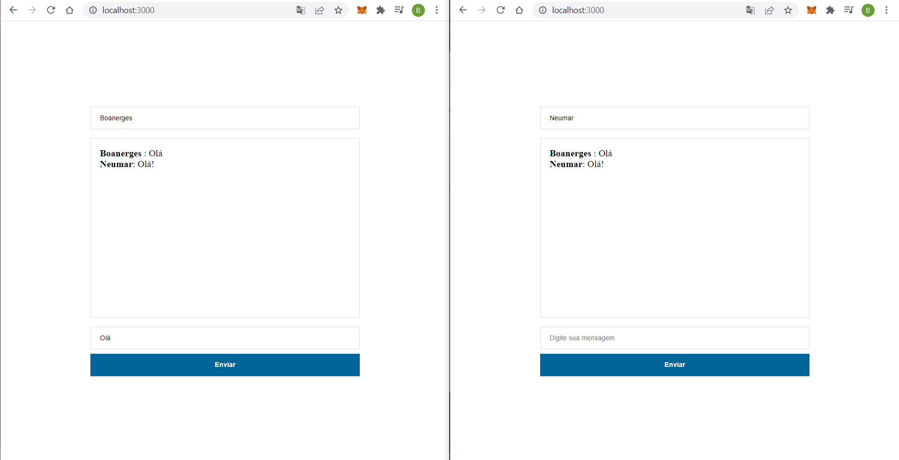

# chat-sockets

### Info

```
Nomes: Boanerges Junior / Caio Gottmann
Turma: 10A
Matrícula: 201821136 / 201910348

Este repositório tem como objetivo armazenar o projeto proposto da disciplina de Sistemas Distribuídos
ministrada pelo professor Neumar Costa Malheiros
```

### Como iniciar

```bash
- Clone este repositório
$git clone https://github.com/BoanergesJunior/chat-sockets.git

- Instale as dependências
$yarn i || npm i

- Inicie o projeto
$yarn start
```

### O que se deve esperar

```
Para verificar o projeto funcionando abra seu navagador e crie 2 abas com a url: http://localhost:3000
uma tela simulando um chat irá aparecer. Agora basta preencher o que se pede nos placeholders e iniciar a simulação de comunicação entre usuários.
```

### Imagem


